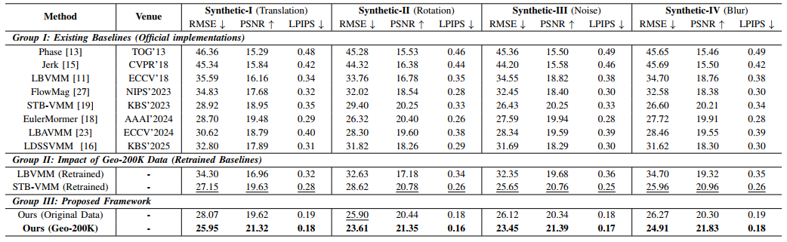

# GeoMag: Geometric-Aware Video Motion Magnification via State Space Model

This repository contains the official implementation of GeoMag, a deep learning model for video motion magnification based on state space models.




## Overview

Video Motion Magnification (VMM) reveals imperceptible dynamics but often struggles with structural inconsistencies under complex geometric transformations. Existing models
generally face a trade-off between the lack of global context in
CNNs and the prohibitive computational costs of Transformers.
Furthermore, current training protocols relying on simple linear
motions fail to capture real-world complexity. To address these
challenges, we propose GeoMag, a novel framework leveraging
State Space Models to achieve global spatial consistency with
linear complexity. To bridge the domain gap, a large-scale
synthetic dataset, Geo-200K, is established, explicitly constructed
to incorporate rich geometric transformations. Extensive experiments demonstrate that GeoMag significantly outperforms
state-of-the-art methods in both visual fidelity and computational efficiency, robustly magnifying complex motions while
eliminating artifacts.


## Installation

### Prerequisites

- Python 3.8+
- CUDA 11.8+ (for GPU acceleration)
- FFmpeg (for video processing)

### Dependencies

Install PyTorch and related packages:

```bash
pip install torch==2.2.0 torchvision==0.17.0 torchaudio==2.2.0 --index-url https://download.pytorch.org/whl/cu118
```

Install Mamba SSM:

```bash
pip install packaging ninja
pip install causal-conv1d>=1.2.0
pip install mamba-ssm==2.2.0
```

Install other dependencies:

```bash
pip install -r requirements.txt
```

## Dataset Preparation

### Synthetic Dataset Generation

We provide a synthetic dataset generation script (`dataset.py`) to create training data with rich geometric transformations. The script requires background images list (`--bg_txt`) and foreground images with masks list (`--fg_txt`, format: `fg_path mask_path` per line).

```bash
python dataset.py \
    --bg_txt backgrounds.txt \
    --fg_txt foregrounds.txt \
    --output_dir ./dataset \
    --num_samples 200000 \
    --img_size 384 \
    --num_workers 8
```

After generation, shuffle and rename samples sequentially:
```bash
python dataset.py --output_dir ./dataset --finalize_shuffle --shuffle_seed 42
```

### Geo-200K Dataset

We are preparing to release **Geo-200K**, our own large-scale synthetic dataset for video motion magnification. This dataset contains 200K samples with diverse geometric transformations and will be made publicly available soon.

### Dataset Structure

The generated dataset will have the following structure:

```
dataset_root/
├── frameA/          # Reference frames
│   ├── 000001.png
│   ├── 000002.png
│   └── ...
├── frameB/          # Target frames
│   ├── 000001.png
│   ├── 000002.png
│   └── ...
├── frameC/          # Auxiliary frames (for regularization)
│   ├── 000001.png
│   ├── 000002.png
│   └── ...
├── amplified/       # Ground truth amplified frames
│   ├── 000001.png
│   ├── 000002.png
│   └── ...
├── meta/            # Metadata JSON files
│   ├── 000001.json
│   ├── 000002.json
│   └── ...
└── train_mf.txt    # Motion magnification factors (one per line)
```

Each metadata JSON file contains detailed information about the sample, including motion parameters, quality metrics, and generation settings.

## Training

Train the model using the provided training script:

```bash
python train.py \
    -d /path/to/dataset \
    -n 10000 \
    -b 16 \
    --epochs 50 \
    -lr 1e-5 \
    --ckpt ./checkpoints \
    --use_amp \
    --weight_lpips 0.35 \
    --weight_reg1 0.15
```

### Key Training Arguments

- `-d, --dataset`: Path to the training dataset
- `-n, --num_data`: Number of training samples
- `-b, --batch_size`: Batch size (default: 16)
- `--epochs`: Number of training epochs (default: 50)
- `-lr, --learning_rate`: Learning rate (default: 1e-5)
- `--ckpt`: Checkpoint save directory
- `--use_amp`: Enable mixed precision training
- `--weight_lpips`: Weight for LPIPS loss (default: 0.35)
- `--weight_reg1`: Weight for regularization loss (default: 0.15)
- `--max_mag_factor`: Maximum magnification factor clamp (default: 40.0)

For distributed training, use standard PyTorch DDP environment variables:

```bash
CUDA_VISIBLE_DEVICES=0,1 python -m torch.distributed.launch \
    --nproc_per_node=2 train.py [arguments...]
```

## Inference

### Video Motion Magnification

Process videos using the batch inference script:

```bash
python magnify_video_batch.py \
    -i input_video.mp4 \
    -o output_prefix \
    -s ./output \
    --mode static \
    -M 30 40 \
    -m ./checkpoints/model.pth
```

### Inference Arguments

- `-i, --input`: Input video file(s)
- `-o, --output-prefix`: Output file prefix(es)
- `-s, --output-dir`: Output directory (default: `./output`)
- `--mode`: Magnification mode (`static` or `dynamic`)
- `-M, --magnifications`: Magnification factor(s)
- `-m, --model`: Path to model checkpoint
- `-f, --fps`: Video frame rate (auto-detected if not specified)
- `-b, --batch-size`: Batch size for inference (default: 1)
- `--device`: Computing device (`auto`, `cpu`, or `cuda`)

### Example Usage

```bash
# Single video with multiple magnification factors
python magnify_video_batch.py \
    -i video.mp4 \
    -o result \
    -M 10 20 30 \
    --mode static

# Multiple videos
python magnify_video_batch.py \
    -i video1.mp4 video2.mp4 \
    -o result1 result2 \
    -M 15 \
    --mode dynamic
```


## Evaluation

The training script includes built-in evaluation functionality:

```bash
# Enable periodic evaluation during training
python train.py \
    [training arguments...] \
    --eval_freq 5 \
    --eval_num_samples 4 \
    --eval_dataset /path/to/eval_dataset
```

Evaluation metrics include:
- L1 Loss
- LPIPS (Learned Perceptual Image Patch Similarity)
- SSIM (Structural Similarity Index)
- PSNR (Peak Signal-to-Noise Ratio)


